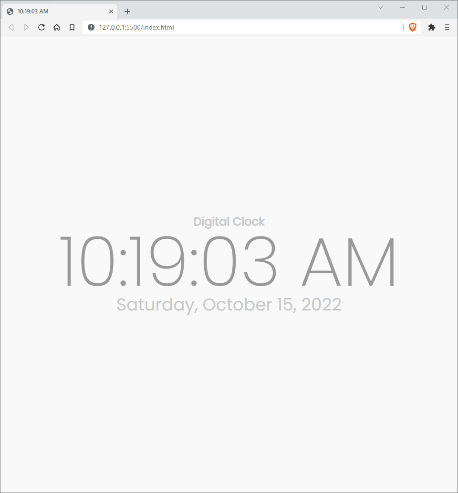

  <h1 align="center">Digital Clock<h3 align="center">Simple digital clock to show date and time with dark/light mode. ⌚</h3>

## ScreenShot
  <h5 align="center">Dark</h5>
  
  <h5 align="center">Light</h5>
  